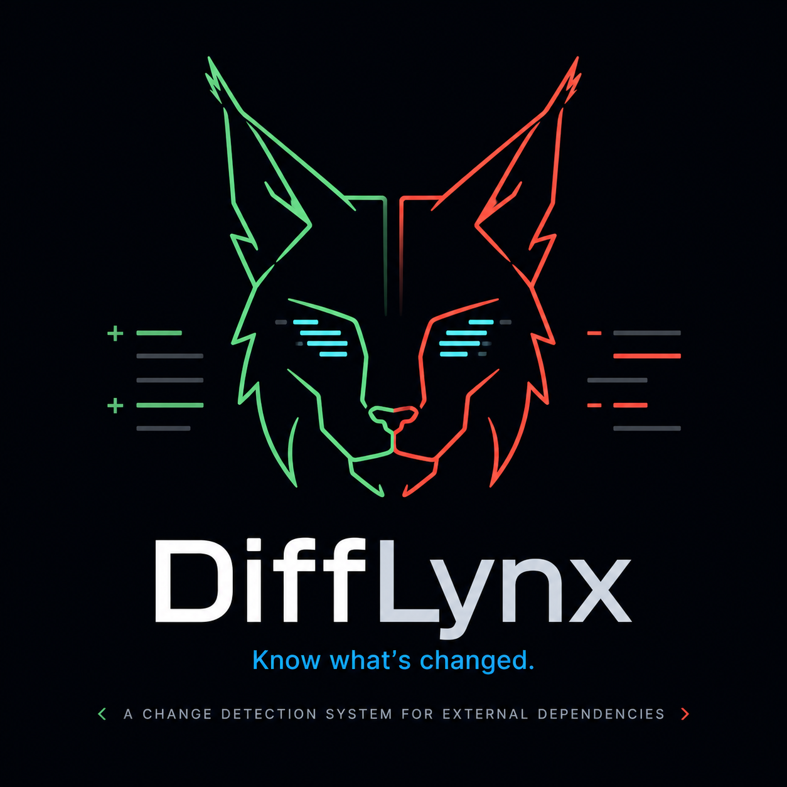

<p align="center">
  
</p>

# gemini-docs-watcher

Monitors all sub-pages under multiple docs sites for content changes and sends alerts via Gmail and Slack.

## Setup

**1. Install dependencies**

```bash
cd /Users/gedalyahreback/Agentic/gemini-docs-watcher
python3 -m venv .venv
source .venv/bin/activate
pip install -r requirements.txt
```

**2. Configure credentials**

```bash
cp .env.example .env
```

Fill in `.env` with your values:

- `GMAIL_APP_PASSWORD` — a 16-character App Password from https://myaccount.google.com/apppasswords (requires 2-Step Verification on the sender account).
- `SLACK_BOT_TOKEN` — a Bot Token (`xoxb-...`) from your Slack app with `chat:write` scope, with the bot invited to your channel.
- `WATCH_URLS` — comma-separated list of docs base URLs to crawl. All linked sub-pages under each URL are discovered automatically.
- `ALERT_MODE` — `per-site` (default) or `digest`. See Alert Modes below.

## Sites monitored by default

The following URLs are used when `WATCH_URLS` is not set in `.env`:

```
https://geminicli.com/docs/
https://docs.tabnine.com
https://docs.github.com/en/copilot
https://cursor.com/docs
https://gitbook.com/docs
https://docs.slack.dev/
https://code.claude.com/docs/en/overview
https://developers.openai.com/codex
```

## Alert modes

`per-site` sends a separate Gmail email and Slack message for each site that has changes. `digest` sends one Gmail email and one Slack message listing all changed sites together.

Mode is resolved in this priority order (highest wins):

1. CLI `--mode` flag
2. `config.json` (written by the Slack slash command server)
3. `ALERT_MODE` in `.env`
4. Default: `per-site`

## Running

**First run — build the baseline snapshot (no alert sent):**

```bash
source .venv/bin/activate
python3 watcher.py
```

**Subsequent runs — detect changes and send alerts:**

```bash
python3 watcher.py
```

**Override alert mode for a single run:**

```bash
python3 watcher.py --mode digest
python3 watcher.py --mode per-site
```

**Dry run — crawl all sites and print changes without sending alerts:**

```bash
python3 watcher.py --dry-run
```

You can combine `--dry-run` with `--mode`:

```bash
python3 watcher.py --dry-run --mode digest
```

## Snapshot migration

If you are upgrading from the single-site version, the old `snapshot.json` (flat `{url: hash}` format) is automatically migrated to the new nested format (`{site_base: {url: hash}}`) on the first run.

## Scheduling with cron (daily at 8 AM)

Run `crontab -e` and add:

```
0 8 * * * cd /Users/gedalyahreback/Agentic/gemini-docs-watcher && /Users/gedalyahreback/Agentic/gemini-docs-watcher/.venv/bin/python3 watcher.py >> /Users/gedalyahreback/Agentic/gemini-docs-watcher/watcher.log 2>&1
```

## Slack slash command server

The watcher includes an optional lightweight HTTP server (powered by Flask) that lets you change the alert mode at runtime via a Slack slash command without editing `.env`.

**Start the server:**

```bash
python3 watcher.py --slack-server
```

The server listens on port 3000 for `POST /slack/command`. Configure your Slack app's slash command (e.g., `/docswatcher`) to point to `https://your-host:3000/slack/command`.

**Supported commands:**

```
/docswatcher mode digest
/docswatcher mode per-site
```

The selected mode is written to `config.json` in the project directory and takes effect on the next watcher run (unless overridden by the `--mode` CLI flag).

## How it works

On each run the script crawls every page linked under each configured base URL, computes a SHA-256 hash of each page's HTML, and compares against `snapshot.json`. When pages are added, changed, or removed, it sends an alert listing the affected URLs to Gmail and Slack, then updates the snapshot.
